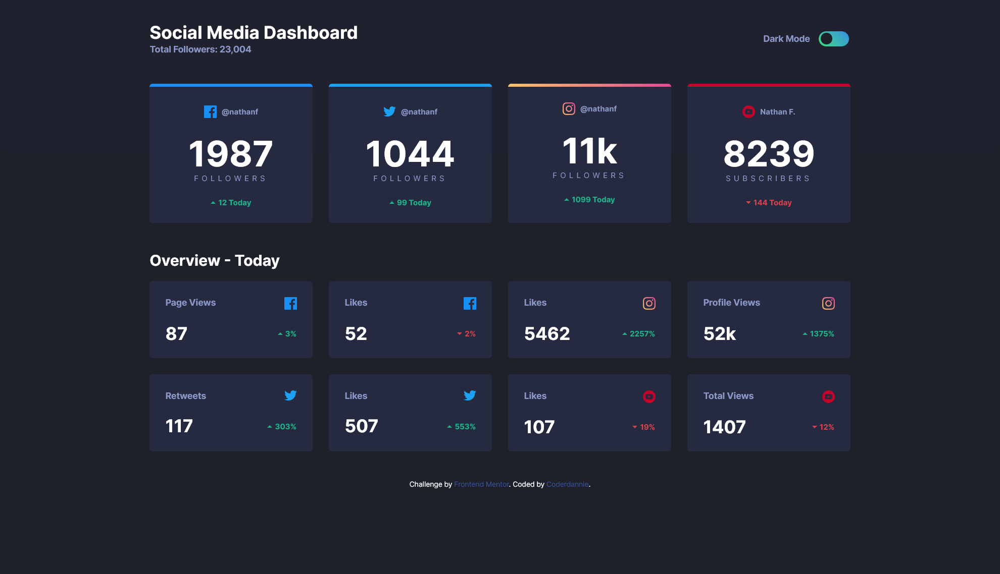
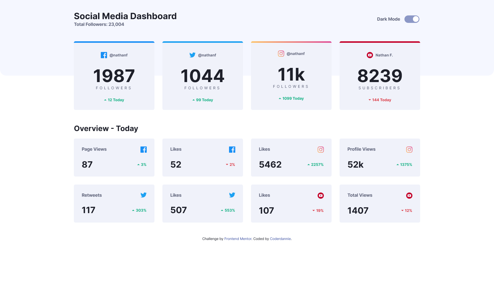

# Frontend Mentor - Social media dashboard with theme switcher solution

## Table of contents

- [Overview](#overview)
  - [The challenge](#the-challenge)
  - [Screenshot](#screenshot)
  - [Links](#links)
- [My process](#my-process)
  - [Built with](#built-with)
  - [What I learned](#what-i-learned)
  - [Continued development](#continued-development)
  - [Useful resources](#useful-resources)
- [Author](#author)
- [Acknowledgments](#acknowledgments)

## Overview

### The challenge

Users should be able to:

- View the optimal layout for the site depending on their device's screen size
- See hover states for all interactive elements on the page
- Toggle color theme to their preference

### Screenshot




### Links

- Solution URL: [Solution url](https://www.frontendmentor.io/solutions/socialmediadashboard-with-theme-switcher-j42UU7nN_h)
- Live Site URL: [Live Site Url](https://coderdannie-darklight-toggle-page.netlify.app/)

## My process

### Built with

- Semantic HTML5 markup
- CSS custom properties
- Flexbox
- CSS Grid
- Mobile-first workflow
- Vanilla Js
- [Styled Components]Sass/scss

### What I learned

This is my first time of building light and dark mode page. What i learnt majorly is how to switch colors mode using
css 'has' element with full browser support using javascript. I also learnt how to use browser localstorage for storing states.

```css
.light,
:root:has(#light:checked) {
  --dark-bg: hsl(0, 0%, 100%);
  --dark-top-bg: hsl(225, 100%, 98%);
  --dark-card: hsl(227, 47%, 96%);
  --dark-text1: hsl(228, 12%, 44%);
  --dark-text2: hsl(230, 17%, 14%);
  --toggle-bg-end: hsl(228, 34%, 66%);
  --toggle-bg-start: hsl(228, 34%, 66%);
  --dark-card-hover: hsl(225, 35%, 91%);
}
```

```js
const setTheme = function () {
  const activeTheme = localStorage.getItem('theme');
  colorThemes.forEach((themeOption) => {
    if (themeOption.id === activeTheme) {
      themeOption.checked = true;
    }
  });
  //fallback for no :has() support
  document.documentElement.className = activeTheme;
};
```

### Continued development

I will focus more on how to use css grid for complex layouts and also how to write more efficient code.

### Useful resources

- [Example resource 1](https://developer.mozilla.org/en-US/) - This helped me to know more about input radio button and some other css styles i used in this project.
- [Example resource 2](https://stackoverflow.com) - This is an amazing article which helped me finally to get solutions to all of the problem i encountered. I'd recommend it to anyone who get stuck or faces some issues while building this project.

## Author

- Website - [frontendmentor](https://www.frontendmentor.io)
- Frontend Mentor - [@coderdannie](https://www.frontendmentor.io/profile/coderdannie)
- Twitter - [@coderdannie](https://www.twitter.com/coderdannie)

## Acknowledgments

I specially thank my tutors @kelvin powell and @codercoder. They are the source of my inspiration.
